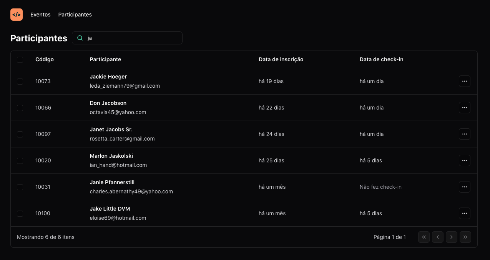

<h1 align="center"> Pass.in </h1>

<p align="center"> 
  O pass.in é uma aplicação de gestão de participantes em eventos presenciais.
</p>

## Tecnologias Utilizadas

- ReactJS ( HTTP State, URL State )
- TypeScript
- Tailwindcss
- Tailwindcss Forms
- Tailwind Merge
- Lucide React
- Faker JS
- DayJS
- Vite

## Rodando

Após clonar o repositório, acesse a pasta do projeto e execute os comandos abaixo:

```sh
npm install
npm run dev
```

Acesse http://localhost:5173 para visualizar a aplicação.

<!--START_SECTION:footer-->

---

Desenvolvido 💚 por Vanessa Brazuna

<!--END_SECTION:footer-->

